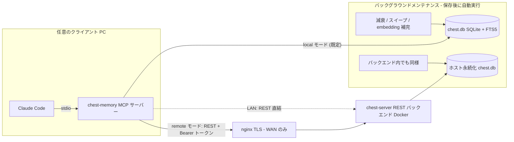

# mcp-chest-memory

[English](README.md) | **日本語**

**次のような悩みは、今日から不要です:**

- 何回も同じ指示をしなければいけない
- 何回も同じ質問に答えなければいけない
- LLM が毎回同じところでつまずいている
- トークン消費が激しすぎて、すぐにリミットに引っかかってしまう

mcp-chest-memory は、これらをすべて自動で解決します。

- **この MCP を取り込むことで、あとは何もする必要はありません。**
- **自動で作業内容・失敗の原因・調査の結果を、複数プロジェクトにまたがって記憶します。**

**この MCP を導入することで、LLM はあなたと一緒に成長していきます。
ミスや同じ質問をすることがどんどん減っていき、まるであなたの分身のように LLM はふるまうようになっていきます。**

**さらに良い副作用として、LLM の利用トークンを大幅に削減することができます。**

**コーディングエージェントのためのローカルファースト永続記憶（MCP サーバー）。**
エージェントはセッションが終わると全部忘れます。chest は「過去の自分」を耐久的・検索可能な形で残します — 二度と繰り返してはいけない失敗、意思決定とその理由、ファイル単位の編集履歴。すべてあなたのマシン上の単一 SQLite ファイルに保存されます。

記憶ストアは**複数プロジェクト・複数 LLM をまたいで共有**され、人間が意識しなくても LLM が自動で知識を参照・記録します — 同じ指示を何回も出さなくて済むようになります。

Claude Code 向けに最適化（スキル + フック同梱）。MCP クライアントなら何でも動作します。

この MCP は簡単に利用できるように作られています。個人利用から複数拠点での利用、
プロジェクトチーム全体での利用までを想定してスケールできるようになっています。
まずは個人で利用するところから始めて、その効果を実感してください。
個人で利用するのはとても簡単です。

## 特徴

- **6 層構造化記憶** — `goal` / `context` / `emotion` / `implementation` /
  `realize`（失敗・罠の記録。忘却から保護）/ `learning`（気づき・意思決定）
- **ハイブリッド recall** — SQLite FTS5 trigram 全文検索とベクトル類似度を
  Reciprocal Rank Fusion で融合し、アクセス熱・エンティティ momentum・重要度で重み付け
- **構造的に多言語対応** — trigram トークナイザは形態素解析器不要。
  日本語・中国語・韓国語も空白区切り言語も同じように検索可能
- **オフラインファースト embedding** — 小型多言語モデル
  （`multilingual-e5-small`、ONNX、約 120MB）を transformers.js でローカル実行。
  API キー不要、初回のモデルダウンロード後はネットワーク不要
- **記憶のライフサイクル** — ACT-R 風の activation 減衰、TTL 失効、
  archive-first 削除、supersession 検出、スリープモード統合（consolidation）
- **トークン節約ファイル読み込み** — `chest_read_smart` がチャンクハッシュを
  キャッシュし、前回読み込みからの変更分だけを返す
- **セッション継続** — 作業状態スナップショットがコンテキスト圧縮（compaction）を
  跨いで生存（Claude Code の PreCompact / SessionStart フック）
- **3 つの配備プロファイル** — 同じツール・同じセマンティクスのまま:
  シングル PC / LAN 共有（Docker）/ WAN（nginx + TLS）


## インストール

必要要件: Node.js ≥ 24。clone 不要 — すべて `npx` で実行されます。

### 単独 PC（ローカル SQLite）

データベースは自分のマシンの `~/.chest-memory/chest.db` に保存されます。

#### 一括セットアップ（hooks・スキル・MCP 登録まで一括）

```bash
npx -y -p mcp-chest-memory chest-memory-setup --yes
```

MCP サーバーの登録（`npx -y mcp-chest-memory` 経由）、`/chest-memory` スキルの
配置、フックの設定が完了します。データベーススキーマは初回起動時に自動作成され、
embedding モデル（約 120MB）は初回利用時にバックグラウンドでダウンロードされます。

#### `~/.claude.json` へ手動で追加する場合

```bash
claude mcp add -s user chest-memory -- npx -y mcp-chest-memory
```

フックとスキルは別途インストールします:

```bash
npx -y -p mcp-chest-memory chest-memory-install-hooks
npx -y -p mcp-chest-memory chest-memory-install-skill
```

### `~/.claude/projects/` から初期データ生成（任意）

`~/.claude/projects/` 配下の過去セッションすべてと各プロジェクトの
自動メモリファイル（`memory/*.md`）を記憶ストアに取り込み、
embedding まで 1 コマンドで完結します:

```bash
npx -y -p mcp-chest-memory chest-memory-import --all
```

`--dry-run` で書き込みなし確認、`--skip-embed` で embedding 補完を後回し
（バックグラウンドメンテナンスが補完）。再実行は冪等で安全です。

### 複数 PC（LAN）— Docker バックエンド

全クライアントが同一の SQLite データベースを共有します（Docker ホスト上に保存）。

#### バックエンドを起動（データを持つホスト側）

リポジトリをクローンして `deploy/` ディレクトリを取得し、
トークンを生成してコンテナを起動します:

```bash
git clone https://github.com/siosig/mcp-chest-memory.git
cd mcp-chest-memory
openssl rand -hex 32   # これをコピーしておく — 全クライアントで使う
cd deploy
CHEST_API_TOKEN=<token> docker compose up -d
```

SQLite ファイルは `deploy/data/chest.db` に永続化され、コンテナを
再作成しても残ります。バックエンドのレプリカは必ず 1 つ。

#### 各クライアント PC に登録

```bash
npx -y -p mcp-chest-memory chest-memory-setup --docker http://<host-ip>:8765 <token> --yes
```

#### `~/.claude.json` へ手動で追加する場合（各クライアント）

```bash
claude mcp add -s user chest-memory \
  -e CHEST_MODE=remote \
  -e CHEST_REMOTE_URL=http://<host-ip>:8765 \
  -e CHEST_API_TOKEN=<token> \
  -- npx -y mcp-chest-memory
```

### 複数 PC（WAN）— Docker + nginx TLS

LAN と同じ Docker バックエンドを nginx 経由で公開します。

#### バックエンドを起動

LAN と同じ手順。nginx と同一ホストの場合はポートマッピングを
`127.0.0.1:8765:8765` に変更して localhost に束縛します。

#### nginx を設定

[`deploy/nginx.conf.example`](deploy/nginx.conf.example) を nginx 設定に
コピーし、`server_name` と証明書パスを設定して
`nginx -t && systemctl reload nginx`。バックエンドは `/chest-memory`
パスプレフィックスで公開されます。

#### 各クライアント PC に登録

```bash
npx -y -p mcp-chest-memory chest-memory-setup --nginx https://chest.example.com/chest-memory <token> --yes
```

#### `~/.claude.json` へ手動で追加する場合（各クライアント）

```bash
claude mcp add -s user chest-memory \
  -e CHEST_MODE=remote \
  -e CHEST_REMOTE_URL=https://chest.example.com/chest-memory \
  -e CHEST_API_TOKEN=<token> \
  -- npx -y mcp-chest-memory
```

多層防御: TLS は nginx で終端しつつ、バックエンド自身も Bearer トークンを
検証します。

### アンインストール

```bash
claude mcp remove -s user chest-memory
npx -y -p mcp-chest-memory chest-memory-install-hooks --remove
rm -rf ~/.claude/skills/chest-memory
rm -rf ~/.chest-memory   # 記憶データごと消す場合のみ
```

## 普段の使い方

### やらなければいけないこと: （ほぼ）何もありません

インストール後は、いつもどおり Claude Code で作業するだけです。同梱の
`/chest-memory` スキルがエージェントに recall / 保存のタイミングを教える
ため、記憶の出し入れは自動で行われます。以下はすべて任意です:

- **「覚えておいて: ...」** と言うと、特定の内容を確実に保存できます
- **`/chest-memory`** で直前の文脈を明示的に保存、
  **`/chest-memory status`** でストアの状態を確認できます
- **「これ前にもやらなかったっけ？」** と聞くと recall を強制できます
- フックは `chest-memory-setup --yes` が自動設定します（不要なら
  `--skip-hooks`）: Stop 時のセッション自動キャプチャ、
  コンパクション前後のスナップショット保存/復元

### 何もしなくても自動で走る処理

- **保存のたび**（`chest_remember`）: エージェントがレイヤーを自動分類し、
  SQLite に保存 → FTS5 索引がトリガーで同期 → ローカルモデルがその場で
  ベクトル化。`realize` レイヤーは自動で忘却保護されます
- **recall のたび**（`chest_recall`）: FTS + ベクトルのハイブリッド検索 +
  減衰考慮ランキング。アクセス熱が更新され、よく使う記憶ほど上位に
  来るようになります
- **セッション中**（スキル駆動）: タスク開始時・履歴のあるファイルの編集前に
  recall、エラー解決後・意思決定後に保存が自動で行われます
- **セッション終了のたび**（フック、`chest-memory-setup` が設定）: Stop のたびに
  セッションがキャプチャされ、作業状態スナップショットがコンテキスト圧縮を
  跨いで保持されます
- **保存後のバックグラウンド**（`CHEST_MAINTENANCE_INTERVAL_SEC`、既定 10 分に
  1 回へスロットリング）: activation 減衰の再計算、TTL 失効と archive
  スイープ、supersession 検出、コールドな記憶の統合（consolidation）、
  pending 行の embedding 補完。スケジューラの設定は不要です。手動実行用に
  `chest-index up` も引き続き使えます

### MCP ツール

| ツール | 用途 |
|---|---|
| `chest_remember` | レイヤー指定で記憶を保存（importance / TTL / supersedes 対応） |
| `chest_recall` | 記憶のハイブリッド検索（FTS5 + ベクトル + 減衰考慮ランキング） |
| `chest_recall_file` | ファイルの全編集履歴と編集意図 |
| `chest_update_memory` | 記憶のその場更新（リンクを保持） |
| `chest_list_entities` | 最近の活動順エンティティ一覧 |
| `chest_forget` | ID 指定削除またはリスクベース自動忘却（realize/goal/pin は保護） |
| `chest_consolidate` | コールドな記憶を learning 要約に圧縮 |
| `chest_read_smart` | diff キャッシュ付きファイル読み込み（変更チャンクのみ返却） |

## 動作の仕組み

### アーキテクチャ



| プロファイル | 経路 | データベースの場所 | セットアップ |
|---|---|---|---|
| シングル PC | stdio → プロセス内 SQLite | `~/.chest-memory/chest.db` | `chest-memory-setup --yes` |
| 複数 PC（LAN） | stdio → REST (Bearer) → Docker | ホスト bind mount（`deploy/data/`） | `docker compose up` + `chest-memory-setup --docker` |
| 複数 PC（WAN） | stdio → nginx (TLS) → Docker | ホスト bind mount | 上記 + `deploy/nginx.conf.example` |

MCP ツールの仕様は全プロファイルで同一です。stdio サーバーはツール呼び出しを
プロセス内で実行する（local）か、同じ JSON ペイロードをバックエンドへ転送する
（remote）かだけが異なり、バックエンドも全く同じ実行コードを使います。


### 記憶レイヤー

6 つのレイヤーが記憶の格納方法と減衰の仕方を決定します:

| レイヤー | 意味 | デフォルト TTL | 自動保護 |
|---|---|---|---|
| `goal` | プロジェクトの目的・ゴール | 無期限 | — |
| `context` | 背景事情・タイミング・理由 | 30 日 | — |
| `emotion` | トーン・気分・感情状態 | 14 日 | — |
| `implementation` | 動いた/動かなかったコード・設定・試みた方法 | 90 日 | — |
| `realize` | 二度と踏んではいけない失敗・罠・警告 | 無期限 | **あり** |
| `learning` | 気づき・意思決定・信念の更新 | 365 日 | — |

`realize` レイヤーの記憶は生成時に `protected=1` が付き、自動忘却スイープで削除されません。
`goal` は TTL=無期限かつ忘却対象外です。
`importance >= 0.9` でピン留めするとレイヤー問わず保護されます。

`context` / `emotion` / `implementation` はスリープモード統合（consolidation）の対象です:
cold（heat < 30）かつ 7 日以上経過した記憶が同一（エンティティ, レイヤー）で 2 件以上
溜まると、保護付きの `learning` 1 件に自動圧縮されアーカイブされます。

受け付けるエイリアス: `decisions`/`insights`/`learned` → `learning`、
`warnings`/`pitfalls`/`rule` → `realize`、`why`/`goals` → `goal`、`how`/`tried` → `implementation`

### 忘却ロジック

忘却リスクはエビングハウス忘却曲線をベースに計算されます:

```
risk = heatFactor × importanceFactor × timeFactor

heatFactor       = 1 - (heatScore / 100)
importanceFactor = 1 - importance
timeFactor       = daysSinceLastAccess × (1 + daysSinceLastAccess / 30)
```

| risk | アクション |
|---|---|
| < 50 | 保持 |
| 50 – 199 | **compress** — アーカイブして `learning` エントリに要約 |
| ≥ 200 | **drop** — 完全削除 |

heat スコア（0–100）はアクセス頻度と新しさから計算されます:
30 日以内アクセス数（×3、上限 30）+ 90 日以内アクセス数（上限 20）+ 直近ボーナス
（7 日以内 +20、90 日超 −10）+ 累計ボーナス（上限 15）+ importance ブースト（上限 15）。
バンド: `hot` ≥ 70 / `warm` ≥ 40 / `cold` ≥ 20 / `frozen` < 20。

### 上書きロジック（Supersession）

新しい記憶が保存されると、次のメンテナンスパスで同一エンティティ・同一レイヤーの
最近の記憶と cosine 類似度を比較します。ほぼ重複（cosine ≥ 0.97）が見つかると、
古い記憶がアーカイブされ新しい記憶にリンクされます — 期限切れの近似コピーが
蓄積しない仕組みです。

誤検出を防ぐガード:
- 同一エンティティ + 同一レイヤーが必須
- 90 日の時間窓、エンティティあたり 200 行上限（O(n²) スキャン防止）
- トップレベルキー集合が同じ JSON 記憶は **対象外**（ファイル編集ログや定期スナップショットは構造が同じでも別事実のため）

`chest_remember` ツールの `supersedes` 引数を使うとバッチを待たずに手動で上書きできます。

### ストレージ

単一の SQLite データベース（WAL モード）に、エンティティ・記憶・エッジ・
イベント・ファイルスナップショット・セッション・統合監査行を保持します。
スキーマは Prisma migration で管理し、FTS5 仮想テーブルと同期トリガーは
同じ migration 内の素の SQL です。

### 全文検索: FTS5 trigram

`memories_fts` は 3 文字部分文字列を索引します
（`tokenize='trigram remove_diacritics 1'`）。これは言語非依存です:
CJK テキストに単語分割も MeCab のような形態素解析器も不要です。
3 文字未満のクエリは LIKE 経路にフォールバックします。スコアは SQLite
組み込みの `bm25()` です。

### ハイブリッドランキング

recall クエリでは両経路が走ります:

1. **FTS 経路** — trigram マッチ、bm25 でランキング
2. **ベクトル経路** — クエリをローカルモデルで embedding し、保存済み
   ベクトルとの cosine 類似度（`(model, dim)` が現行モデルと一致する行のみ）で top-k

2 つのランキングを **Reciprocal Rank Fusion**
（`1/(k + rank_fts) + 1/(k + rank_vec)`）で融合し、Min-Max 正規化して
relevance スコアにします。最終 composite は:

```
composite = (0.45·relevance + 0.25·heat + 0.15·momentum + 0.15·importance)
            × activation × ttl_penalty × supersession_penalty
```

- **heat** — その記憶のアクセス頻度・新しさ（hot/warm/cold/frozen）
- **momentum** — 記憶が属するエンティティの最近の活動量
- **activation** — アクセスログから `chest-index` がオフライン計算する
  ACT-R 風の減衰
- **ttl / supersession ペナルティ** — ハード失効前のソフトな降格

### 記憶のライフサイクル

- **Archive-first**: 減衰で物理削除はしません。行に `archived_at` が付き、
  既定の recall から外れます
- **Supersession**: ほぼ重複する新しい記憶（cosine ≥ 0.97、同一エンティティ/
  レイヤー、90 日窓）が前任を archive し、リンクを記録します
- **Consolidation**: コールドで重要度の低い記憶を（エンティティ, レイヤー）
  単位でクラスタリングし、保護付き `learning` 要約 1 件に圧縮します
- **保護**: `realize` レイヤーと pin 済み（importance ≥ 0.9）の記憶は
  自動忘却されません
- **スナップショット**: セッションごとの作業状態スナップショットが
  コンテキスト圧縮を跨いで生存し、SessionStart フックが復元します

### メンテナンス

メンテナンスは自走します: 保存のあと、サーバーがバックグラウンドで
（応答を遅らせずに）activation 再計算 → 減衰/archive スイープ →
supersession スイープ → pending 行の embedding 補完を実行します。
実行は `CHEST_MAINTENANCE_INTERVAL_SEC`（既定 600 秒）に 1 回へ
スロットリングされ、ファイルロックで手動の `chest-index up` とも
排他されます。`CHEST_AUTO_MAINTENANCE=0` で自動実行を止め、すべて
`chest-index` で手動運用することもできます。

## 設定リファレンス

| 変数 | 既定値 | 意味 |
|---|---|---|
| `CHEST_MODE` | `local` | `local` = プロセス内 SQLite / `remote` = REST バックエンドへ転送 |
| `CHEST_DATA_DIR` | `~/.chest-memory` | データルート（DB・モデルキャッシュ） |
| `CHEST_DB_PATH` | `<data dir>/chest.db` | SQLite ファイル |
| `CHEST_REMOTE_URL` | — | バックエンド URL（remote モード） |
| `CHEST_API_TOKEN` | — | 共有 Bearer トークン（未設定だとバックエンドは起動拒否） |
| `CHEST_PORT` | `8765` | REST バックエンドの待受ポート |
| `CHEST_MAX_CONTENT_CHARS` | `8000` | 記憶本文の最大長 |
| `CHEST_SWEEP_LIMIT` | `500` | embedding スイープ 1 回あたりの最大行数 |
| `CHEST_MAINTENANCE_INTERVAL_SEC` | `600` | バックグラウンドメンテナンスの最短実行間隔（秒） |
| `CHEST_AUTO_MAINTENANCE` | `1` | `0` で保存時トリガーの自動メンテナンスを無効化 |

## Claude Code 連携

- **スキル**: `/chest-memory`（`chest-memory-setup` が配置）が直前の会話を
  `realize` / `learning` に自動分類して保存し、判定根拠を表示します。
  `/chest-memory status` でストアの状態を確認できます
- **フック**（`chest-memory-setup --yes` が設定）: `chest-memory-precompact`
  がコンテキスト圧縮前に作業状態スナップショットを保存、
  `chest-memory-session-start` が復元、`chest-memory-sync`（Stop フック）が
  セッションを自動キャプチャ。
  `npx -y -p mcp-chest-memory chest-memory-install-hooks` で再設定、
  `--remove` で解除できます

## 開発

```bash
pnpm install
pnpm typecheck
pnpm test          # 使い捨て SQLite に対する node:test
pnpm build
```

### ソースから導入（開発・セルフホスト LAN/WAN バックエンド構築）

```bash
git clone https://github.com/siosig/mcp-chest-memory.git
cd mcp-chest-memory
pnpm install
pnpm build
npx -y -p mcp-chest-memory chest-memory-setup --yes   # ローカルモード
# リモートモードの場合:
npx -y -p mcp-chest-memory chest-memory-setup --docker <url> <token> --yes
```

## ライセンス

[MIT](LICENSE)
