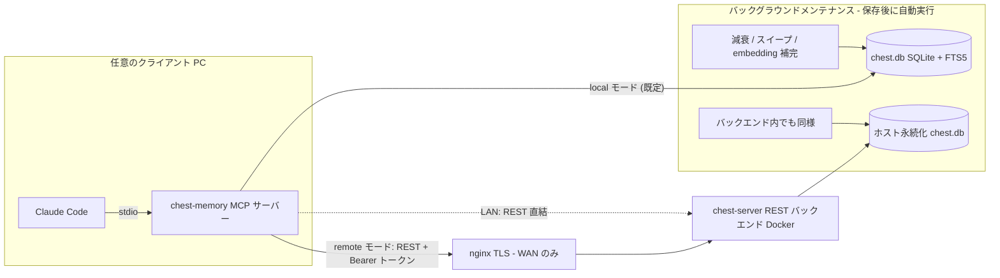

# mcp-chest-memory

[English](README.md) | **日本語**

**次のような悩みは、今日から不要です:**

- 何回も同じ指示をしなければいけない
- 何回も同じ質問に答えなければいけない
- LLM が毎回同じところでつまずいている
- トークン消費が激しすぎて、すぐにリミットに引っかかってしまう

mcp-chest-memory は、これらをすべて自動で解決します。

- **この MCP を取り込むことで、あとは何もする必要はありません。**
- **自動で作業内容・失敗の原因・調査の結果を、複数プロジェクトにまたがって記憶します。**

**この MCP を導入することで、LLM はあなたと一緒に成長していきます。
ミスや同じ質問をすることがどんどん減っていき、まるであなたの分身のように LLM はふるまうようになります。**

**さらに良い副作用として、LLM の利用トークンを大幅に削減することができます。**

**コーディングエージェントのためのローカルファースト永続記憶（MCP サーバー）。**
エージェントはセッションが終わると全部忘れます。chest は「過去の自分」を耐久的・検索可能な形で残します — 二度と繰り返してはいけない失敗、意思決定とその理由、ファイル単位の編集履歴。すべてあなたのマシン上の単一 SQLite ファイルに保存されます。

記憶ストアは**複数プロジェクト・複数 LLM をまたいで共有**され、人間が意識しなくても LLM が自動で知識を参照・記録します — 同じ指示を何回も出さなくて済むようになります。

Claude Code 向けに最適化（スキル + フック同梱）。MCP クライアントなら何でも動作します。

この MCP は簡単に利用できるように作られています。個人利用から複数拠点での利用、
プロジェクトチーム全体での利用までを想定してスケールできるようになっています。
まずは個人で利用するところから始めて、その効果を実感してください。
個人で利用するのはとても簡単です。

## 目次

- [特徴](#特徴)
- [インストール](#インストール)
  - [単独 PC（ローカル SQLite）](#単独-pcローカル-sqlite)
  - [`~/.claude/projects/` から初期データ生成（任意）](#claudeprojects-から初期データ生成任意)
  - [複数 PC（LAN）— Docker バックエンド](#複数-pclan-docker-バックエンド)
  - [複数 PC（WAN）— Docker + nginx TLS](#複数-pcwan-docker--nginx-tls)
  - [アンインストール](#アンインストール)
- [普段の使い方](#普段の使い方)
  - [やらなければいけないこと: （ほぼ）何もありません](#やらなければいけないこと-ほぼ何もありません)
  - [何もしなくても自動で走る処理](#何もしなくても自動で走る処理)
  - [MCP ツール](#mcp-ツール)
- [動作の仕組み](#動作の仕組み)
  - [アーキテクチャ](#アーキテクチャ)
  - [記憶レイヤー](#記憶レイヤー)
  - [忘却ロジック](#忘却ロジック)
  - [上書きロジック（Supersession）](#上書きロジックsupersession)
  - [ストレージ](#ストレージ)
  - [全文検索: FTS5 unicode61 + tokenized](#全文検索-fts5-unicode61--tokenized)
  - [ハイブリッドランキング](#ハイブリッドランキング)
  - [記憶のライフサイクル](#記憶のライフサイクル)
  - [メンテナンス](#メンテナンス)
- [設定リファレンス](#設定リファレンス)
  - [セキュリティ上の注意](#セキュリティ上の注意)
- [Claude Code 連携](#claude-code-連携)
  - [Stop — chest-memory-sync](#stop--chest-memory-sync)
  - [PreCompact — chest-memory-precompact](#precompact--chest-memory-precompact)
  - [SessionStart — chest-memory-session-start](#sessionstart--chest-memory-session-start)
  - [UserPromptSubmit — chest-memory-user-prompt-submit](#userpromptsubmit--chest-memory-user-prompt-submit)
- [開発](#開発)
- [セキュリティ](#セキュリティ)
  - [脅威モデル](#脅威モデル)
  - [原則](#原則)
  - [コードでの実装](#コードでの実装)
  - [残留リスク（設計上）](#残留リスク設計上)
- [ライセンス](#ライセンス)

## 特徴

- **6 層構造化記憶** — `goal` / `context` / `emotion` / `implementation` /
  `realize`（失敗・罠の記録。忘却から保護）/ `learning`（気づき・意思決定）
- **ハイブリッド recall** — SQLite FTS5 unicode61 全文検索（CJK は Sudachi で
  tokenized カラムへ書き込み済み）とベクトル類似度を Reciprocal Rank Fusion で融合し、
  アクセス熱・エンティティ momentum・重要度で重み付け。クロスエンコーダ reranker も選択可能
- **構造的に多言語対応** — 日本語・中国語・韓国語テキストは書き込み時に Sudachi-WASM で
  形態素分割して専用 FTS カラムに保存。欧米語は unicode61 の単語境界分割で対応
- **オフラインファースト embedding** — `Xenova/bge-m3`（1024 次元、ONNX、約 560MB）を
  transformers.js でローカル実行。API キー不要、初回ダウンロード後はネットワーク不要
- **記憶のライフサイクル** — ACT-R 風の activation 減衰、TTL 失効、
  archive-first 削除、supersession 検出、スリープモード統合（consolidation）
- **トークン節約ファイル読み込み** — `chest_read_smart` がチャンクハッシュを
  キャッシュし、前回読み込みからの変更分だけを返す。全プロファイルで動作
  （ファイルはクライアント側で読み、差分キャッシュのスナップショットのみ永続化）
- **セッション継続** — 作業状態スナップショットがコンテキスト圧縮（compaction）を
  跨いで生存（Claude Code の PreCompact / SessionStart フック）
- **3 つの配備プロファイル** — 同じツール・同じセマンティクスのまま:
  シングル PC / LAN 共有（Docker）/ WAN（nginx + TLS）


## インストール

必要要件: Node.js ≥ 24。clone 不要 — すべて `npx` で実行されます。

### 単独 PC（ローカル SQLite）

データベースは自分のマシンの `~/.chest-memory/chest.db` に保存されます。

#### 一括セットアップ（hooks・スキル・MCP 登録まで一括）

```bash
npx -y -p mcp-chest-memory chest-memory-setup --yes
```

MCP サーバーの登録（`npx -y mcp-chest-memory@latest` 経由）、`/chest-memory` スキルの
配置、フックの設定が完了します。データベーススキーマは初回起動時に自動作成され、
embedding モデル（約 560MB）は初回利用時にバックグラウンドでダウンロードされます。

#### `~/.claude.json` へ手動で追加する場合

```bash
claude mcp add -s user chest-memory -- npx -y mcp-chest-memory@latest
```

フックとスキルは別途インストールします:

```bash
npx -y -p mcp-chest-memory chest-memory-install-hooks
npx -y -p mcp-chest-memory chest-memory-install-skill
```

### `~/.claude/projects/` から初期データ生成（任意）

`~/.claude/projects/` 配下の過去セッションすべてと各プロジェクトの
自動メモリファイル（`memory/*.md`）を記憶ストアに取り込み、
embedding まで 1 コマンドで完結します:

```bash
npx -y -p mcp-chest-memory chest-memory-import --all
```

`--dry-run` で書き込みなし確認、`--skip-embed` で embedding 補完を後回し
（バックグラウンドメンテナンスが補完）。再実行は冪等で安全です。

### 複数 PC（LAN）— Docker バックエンド

全クライアントが同一の SQLite データベースを共有します（Docker ホスト上に保存）。

#### バックエンドを起動（データを持つホスト側）

リポジトリをクローンして `deploy/` ディレクトリを取得し、
トークンを生成してコンテナを起動します:

```bash
git clone https://github.com/siosig/mcp-chest-memory.git
cd mcp-chest-memory
openssl rand -hex 32   # これをコピーしておく — 全クライアントで使う
cd deploy
CHEST_API_TOKEN=<token> docker compose up -d
```

SQLite ファイルは `deploy/data/chest.db` に永続化され、コンテナを
再作成しても残ります。バックエンドのレプリカは必ず 1 つ。

#### 各クライアント PC に登録

```bash
npx -y -p mcp-chest-memory chest-memory-setup --docker http://<host-ip>:8765 <token> --yes
```

#### `~/.claude.json` へ手動で追加する場合（各クライアント）

```bash
claude mcp add -s user chest-memory \
  -e CHEST_MODE=remote \
  -e CHEST_REMOTE_URL=http://<host-ip>:8765 \
  -e CHEST_API_TOKEN=<token> \
  -- npx -y mcp-chest-memory@latest
```

### 複数 PC（WAN）— Docker + nginx TLS

LAN と同じ Docker バックエンドを nginx 経由で公開します。

#### バックエンドを起動

LAN と同じ手順。nginx と同一ホストの場合はポートマッピングを
`127.0.0.1:8765:8765` に変更して localhost に束縛します。

#### nginx を設定

[`deploy/nginx.conf.example`](deploy/nginx.conf.example) を nginx 設定に
コピーし、`server_name` と証明書パスを設定して
`nginx -t && systemctl reload nginx`。バックエンドは `/chest-memory`
パスプレフィックスで公開されます。

#### 各クライアント PC に登録

```bash
npx -y -p mcp-chest-memory chest-memory-setup --nginx https://chest.example.com/chest-memory <token> --yes
```

#### `~/.claude.json` へ手動で追加する場合（各クライアント）

```bash
claude mcp add -s user chest-memory \
  -e CHEST_MODE=remote \
  -e CHEST_REMOTE_URL=https://chest.example.com/chest-memory \
  -e CHEST_API_TOKEN=<token> \
  -- npx -y mcp-chest-memory@latest
```

多層防御: TLS は nginx で終端しつつ、バックエンド自身も Bearer トークンを
検証します。

### アンインストール

```bash
claude mcp remove -s user chest-memory
npx -y -p mcp-chest-memory chest-memory-install-hooks --remove
rm -rf ~/.claude/skills/chest-memory
rm -rf ~/.chest-memory   # 記憶データごと消す場合のみ
```

## 普段の使い方

### やらなければいけないこと: （ほぼ）何もありません

インストール後は、いつもどおり Claude Code で作業するだけです。同梱の
`/chest-memory` スキルがエージェントに recall / 保存のタイミングを教える
ため、記憶の出し入れは自動で行われます。以下はすべて任意です:

- **「覚えておいて: ...」** と言うと、特定の内容を確実に保存できます
- **`/chest-memory`** で直前の文脈を明示的に保存、
  **`/chest-memory status`** でストアの状態を確認できます
- **「これ前にもやらなかったっけ？」** と聞くと recall を強制できます
- フックは `chest-memory-setup --yes` が自動設定します（不要なら
  Stop 時のセッション自動キャプチャ、コンパクション前後のスナップショット保存/復元

### 何もしなくても自動で走る処理

- **保存のたび**（`chest_remember`）: エージェントがレイヤーを自動分類し、
  SQLite に保存 → FTS5 索引がトリガーで同期 → ローカルモデルがその場で
  ベクトル化。`realize` レイヤーは自動で忘却保護されます
- **recall のたび**（`chest_recall`）: FTS + ベクトルのハイブリッド検索 +
  減衰考慮ランキング。アクセス熱が更新され、よく使う記憶ほど上位に
  来るようになります
- **セッション中**（スキル駆動）: タスク開始時・履歴のあるファイルの編集前に
  recall、エラー解決後・意思決定後に保存が自動で行われます
- **セッション終了のたび**（フック、`chest-memory-setup` が設定）: Stop のたびに
  セッションがキャプチャされ、作業状態スナップショットがコンテキスト圧縮を
  跨いで保持されます
- **保存後のバックグラウンド**（`CHEST_MAINTENANCE_INTERVAL_SEC`、既定 600 秒 / 10 分に
  1 回へスロットリング）: activation 減衰の再計算、TTL 失効と archive
  スイープ、supersession 検出、コールドな記憶の統合（consolidation）、
  pending 行の embedding 補完。スケジューラの設定は不要です。手動実行用に
  `chest-index up` も引き続き使えます

### MCP ツール

| ツール | 用途 |
|---|---|
| `chest_remember` | レイヤー指定で記憶を保存（importance / TTL / supersedes 対応） |
| `chest_recall` | 記憶のハイブリッド検索（FTS5 + ベクトル + 減衰考慮ランキング） |
| `chest_recall_file` | ファイルの全編集履歴と編集意図 |
| `chest_update_memory` | 記憶のその場更新（リンクを保持） |
| `chest_list_entities` | 最近の活動順エンティティ一覧 |
| `chest_forget` | ID 指定削除またはリスクベース自動忘却（realize/goal/pin は保護） |
| `chest_consolidate` | コールドな記憶を learning 要約に圧縮 |
| `chest_read_smart` | diff キャッシュ付きファイル読み込み（変更チャンクのみ返却） |

## 動作の仕組み

### アーキテクチャ



| プロファイル | 経路 | データベースの場所 | セットアップ |
|---|---|---|---|
| シングル PC | stdio → プロセス内 SQLite | `~/.chest-memory/chest.db` | `chest-memory-setup --yes` |
| 複数 PC（LAN） | stdio → REST (Bearer) → Docker | ホスト bind mount（`deploy/data/`） | `docker compose up` + `chest-memory-setup --docker` |
| 複数 PC（WAN） | stdio → nginx (TLS) → Docker | ホスト bind mount | 上記 + `deploy/nginx.conf.example` |

MCP ツールの仕様は全プロファイルで同一です。stdio サーバーはツール呼び出しを
プロセス内で実行する（local）か、同じ JSON ペイロードをバックエンドへ転送する
（remote）かだけが異なり、バックエンドも全く同じ実行コードを使います。

`chest_read_smart` だけは性質上の例外です — クライアント側のファイルを読む
唯一のツールであるため、そのファイル I/O（root 封じ込め → stat → read → chunk
→ hash）は常に stdio サーバー側、つまりファイルとクライアント宣言の root が実在
する場所で実行されます。バックエンドへ渡るのは差分キャッシュのスナップショット
だけで、その永続化も同じ executor ポート（local は SQLite、remote はバックエンド）
を経由します。これによりトークン節約読み込みは全プロファイルで機能し、バック
エンドがクライアントのファイルを読むことはなく、ツール内に `if (remote)` 分岐も
入りません。


### 記憶レイヤー

6 つのレイヤーが記憶の格納方法と減衰の仕方を決定します:

| レイヤー | 意味 | デフォルト TTL | 自動保護 |
|---|---|---|---|
| `goal` | プロジェクトの目的・ゴール | 無期限 | — |
| `context` | 背景事情・タイミング・理由 | 30 日 | — |
| `emotion` | トーン・気分・感情状態 | 14 日 | — |
| `implementation` | 動いた/動かなかったコード・設定・試みた方法 | 90 日 | — |
| `realize` | 二度と踏んではいけない失敗・罠・警告 | 無期限 | **あり** |
| `learning` | 気づき・意思決定・信念の更新 | 365 日 | — |

`realize` レイヤーの記憶は生成時に `protected=1` が付き、自動忘却スイープで削除されません。
`goal` は TTL=無期限かつ忘却対象外です。
`importance >= 0.9` でピン留めするとレイヤー問わず保護されます。

`context` / `emotion` / `implementation` はスリープモード統合（consolidation）の対象です:
cold（heat < 30）かつ 7 日以上経過した記憶が同一（エンティティ, レイヤー）で 2 件以上
溜まると、保護付きの `learning` 1 件に自動圧縮されアーカイブされます。

受け付けるエイリアス: `decisions`/`insights`/`learned` → `learning`、
`warnings`/`pitfalls`/`rule` → `realize`、`why`/`goals` → `goal`、`how`/`tried` → `implementation`

### 忘却ロジック

忘却リスクはエビングハウス忘却曲線をベースに計算されます:

```
risk = heatFactor × importanceFactor × timeFactor

heatFactor       = 1 - (heatScore / 100)
importanceFactor = 1 - importance
timeFactor       = daysSinceLastAccess × (1 + daysSinceLastAccess / 30)
```

| risk | アクション |
|---|---|
| < 50 | 保持 |
| 50 – 199 | **compress** — アーカイブして `learning` エントリに要約 |
| ≥ 200 | **drop** — 完全削除 |

heat スコア（0–100）はアクセス頻度と新しさから計算されます:
30 日以内アクセス数（×3、上限 30）+ 90 日以内アクセス数（上限 20）+ 直近ボーナス
（7 日以内 +20、90 日超 −10）+ 累計ボーナス（上限 15）+ importance ブースト（上限 15）。
バンド: `hot` ≥ 70 / `warm` ≥ 40 / `cold` ≥ 20 / `frozen` < 20。

### 上書きロジック（Supersession）

新しい記憶が保存されると、次のメンテナンスパスで同一エンティティ・同一レイヤーの
最近の記憶と cosine 類似度を比較します。ほぼ重複（cosine ≥ 0.97）が見つかると、
古い記憶がアーカイブされ新しい記憶にリンクされます — 期限切れの近似コピーが
蓄積しない仕組みです。

誤検出を防ぐガード:
- 同一エンティティ + 同一レイヤーが必須
- 90 日の時間窓、エンティティあたり 200 行上限（O(n²) スキャン防止）
- トップレベルキー集合が同じ JSON 記憶は **対象外**（ファイル編集ログや定期スナップショットは構造が同じでも別事実のため）

`chest_remember` ツールの `supersedes` 引数を使うとバッチを待たずに手動で上書きできます。

### ストレージ

単一の SQLite データベース（WAL モード）に、エンティティ・記憶・エッジ・
イベント・ファイルスナップショット・セッション・統合監査行を保持します。
スキーマは Prisma migration で管理し、FTS5 仮想テーブルと同期トリガーは
同じ migration 内の素の SQL です。

### 全文検索: FTS5 unicode61 + tokenized

`memories_fts` は `content_tokenized` カラムを対象とするコンテンツテーブル型
FTS5 仮想テーブルです（`tokenize='unicode61 remove_diacritics 1'`）。
書き込み時に Sudachi-WASM が日本語・中国語・韓国語テキストを形態素分割し、
スペース区切りトークンを `content_tokenized` に保存します。欧米語は unicode61
が単語境界で分割します。3 文字未満のクエリは LIKE 経路にフォールバックします。
スコアは SQLite 組み込みの `bm25()` です。

`CHEST_FTS_TOKENIZE=false` にすると Sudachi tokenization を無効化できます
（CJK の recall 品質が低下します）。

### ハイブリッドランキング

recall クエリでは両経路が走ります:

1. **FTS 経路** — `content_tokenized` に対する unicode61 マッチ、bm25 でランキング
2. **ベクトル経路** — クエリをローカルモデルで embedding し、保存済み
   ベクトルとの cosine 類似度（`(model, dim)` が現行モデルと一致する行のみ）で top-k

2 つのランキングを **Reciprocal Rank Fusion**
（`1/(k + rank_fts) + 1/(k + rank_vec)`）で融合し、Min-Max 正規化して
relevance スコアにします。最終 composite は:

```
composite = (0.45·relevance + 0.25·heat + 0.15·momentum + 0.15·importance)
            × activation × ttl_penalty × supersession_penalty
```

- **heat** — その記憶のアクセス頻度・新しさ（hot/warm/cold/frozen）
- **momentum** — 記憶が属するエンティティの最近の活動量
- **activation** — アクセスログから `chest-index` がオフライン計算する
  ACT-R 風の減衰
- **ttl / supersession ペナルティ** — ハード失効前のソフトな降格

### 記憶のライフサイクル

- **Archive-first**: 減衰で物理削除はしません。行に `archived_at` が付き、
  既定の recall から外れます
- **Supersession**: ほぼ重複する新しい記憶（cosine ≥ 0.97、同一エンティティ/
  レイヤー、90 日窓）が前任を archive し、リンクを記録します
- **Consolidation**: コールドで重要度の低い記憶を（エンティティ, レイヤー）
  単位でクラスタリングし、保護付き `learning` 要約 1 件に圧縮します
- **保護**: `realize` レイヤーと pin 済み（importance ≥ 0.9）の記憶は
  自動忘却されません
- **スナップショット**: セッションごとの作業状態スナップショットが
  コンテキスト圧縮を跨いで生存し、SessionStart フックが復元します

### メンテナンス

メンテナンスは自走します: 保存のあと、サーバーがバックグラウンドで
（応答を遅らせずに）activation 再計算 → 減衰/archive スイープ →
supersession スイープ → pending 行の embedding 補完を実行します。
実行は `CHEST_MAINTENANCE_INTERVAL_SEC`（既定 600 秒 / 10 分）に 1 回へ
スロットリングされ、ファイルロックで手動の `chest-index up` とも
排他されます。`CHEST_AUTO_MAINTENANCE=0` で自動実行を止め、すべて
`chest-index` で手動運用することもできます。

## 設定リファレンス

| 変数 | 既定値 | 意味 |
|---|---|---|
| `CHEST_MODE` | `local` | `local` = プロセス内 SQLite / `remote` = REST バックエンドへ転送 |
| `CHEST_DATA_DIR` | `~/.chest-memory` | データルート（DB・モデルキャッシュ） |
| `CHEST_DB_PATH` | `<data dir>/chest.db` | SQLite ファイル |
| `CHEST_REMOTE_URL` | — | バックエンド URL（remote モード） |
| `CHEST_API_TOKEN` | — | 共有 Bearer トークン（未設定だとバックエンドは起動拒否。**最低 32 文字**） |
| `CHEST_PORT` | `8765` | REST バックエンドの待受ポート |
| `CHEST_BIND_HOST` | `0.0.0.0` | REST バックエンドの待受ホスト。リバースプロキシ前段時は `127.0.0.1` で loopback のみに制限 |
| `CHEST_MAX_CONTENT_CHARS` | `8000` | 記憶本文の最大長（1 以上にクランプ。0・負値は無視） |
| `CHEST_FORGET_SWEEP_CAP` | `200` | `memory_id` 省略時の `chest_forget` 1 回で archive する最大件数 |
| `CHEST_SWEEP_LIMIT` | `500` | embedding スイープ 1 回あたりの最大行数 |
| `CHEST_MAINTENANCE_INTERVAL_SEC` | `600` | バックグラウンドメンテナンスの最短実行間隔（秒） |
| `CHEST_AUTO_MAINTENANCE` | `1` | `0` で保存時トリガーの自動メンテナンスを無効化 |
| `CHEST_EMBED_MODEL` | `Xenova/bge-m3` | Embedding モデル ID。`Xenova/multilingual-e5-small` を指定すると v1.5 以前の動作に戻せる |
| `CHEST_FTS_TOKENIZE` | `true` | 書き込み時に Sudachi 形態素 tokenization を行う（`false` または `0` で無効化。CJK recall が低下） |
| `CHEST_RERANK_ENABLED` | `false` | RRF 融合後にクロスエンコーダ reranking を有効化（`true` または `1` で有効） |
| `CHEST_RERANK_MODEL` | `onnx-community/bge-reranker-v2-m3-ONNX` | Reranker モデル ID（`CHEST_RERANK_ENABLED=true` 時のみ使用） |
| `CHEST_RERANK_TOP_N` | `20` | Reranker に渡す候補数（1–200） |
| `CHEST_RERANK_TIMEOUT_MS` | `5000` | Reranker 推論のタイムアウト（ms、100–30000）。タイムアウト時は rerank 前の順序を使用 |

### セキュリティ上の注意

- **トークン長**: REST バックエンドは `CHEST_API_TOKEN` が 32 文字未満だと起動を拒否する。
  `openssl rand -hex 32`（64 文字）で満たせる。
- **コマンドライン引数のトークン**: `claude mcp add` 等にトークンをインライン指定すると、
  共有マシンでは `/proc/<pid>/cmdline` やシェル履歴から読み取れる。シークレットマネージャや
  env ファイル経由で渡し、履歴は適宜削除すること。
- **ネットワーク露出**: LAN プロファイルは既定で全インタフェースに公開し、平文 HTTP +
  Bearer トークンのみで保護する。信頼できるネットワークでのみ運用するか、
  `CHEST_BIND_HOST=127.0.0.1` + nginx + TLS（WAN プロファイル）で制限すること。同梱の
  nginx サンプルは HSTS と制限的な CSP を送出する。
- **ファイル読み取り**: `chest_read_smart` は MCP クライアントが宣言した root 配下のみを
  読み取り、ファイル読み込みは常に root が実在する MCP サーバープロセス側で行われ、
  バックエンドでは行われない。REST バックエンドへ直接 POST された `chest_read_smart` は
  （クライアント root が無いため）拒否されるので、トークン保有者がバックエンドホストの
  任意ファイルを読むことはできない。remote モードで転送されるのは差分キャッシュの
  スナップショット行のみで、バックエンドが開くファイルパスは渡らない。

## Claude Code 連携

- **スキル**: `/chest-memory`（`chest-memory-setup` が配置）が直前の会話を
  `realize` / `learning` に自動分類して保存し、判定根拠を表示します。
  `/chest-memory status` でストアの状態を確認できます
- **フック**（`chest-memory-setup --yes` が設定）: 4 つのフックが
  `~/.claude/settings.json` に登録されます。
  `npx -y -p mcp-chest-memory chest-memory-install-hooks` で再設定、
  `--remove` で解除できます。

#### Stop — `chest-memory-sync`

アシスタントターンが終了するたびに発火。`stop_hook_active` が真のときは
再帰的な Stop チェーンを防ぐためスキップします。

| | |
|---|---|
| **stdin** | `{ session_id, transcript_path, cwd, stop_hook_active, … }` |
| **stdout** | なし |
| **動作** | `transcript_path` が `~/.claude/projects/` 配下であることを `realpathSync` で検証します。ローカルモードでは JSONL トランスクリプトを SQLite 記憶ストアにインポートします。リモートモードでは JSONL 本文をバックエンドへ POST してサーバー側でインポートします。 |

#### PreCompact — `chest-memory-precompact`

Claude Code がコンテキストを圧縮する直前に発火（手動・自動いずれも）。
エラー時も `0` で終了し、コンパクションを絶対にブロックしません。

| | |
|---|---|
| **stdin** | `{ session_id, transcript_path, trigger: "manual"\|"auto" }` |
| **stdout** | なし |
| **動作** | `saveSnapshot(session_id)` を呼び出し、作業状態サマリー（≤ 2 KB）を `session_snapshots` テーブルへ UPSERT します。リモートモードでは REST API 経由でバックエンドへ委譲します。 |

#### SessionStart — `chest-memory-session-start`

セッションの最初に発火。

| | |
|---|---|
| **stdin** | `{ session_id, source: "startup"\|"resume"\|"clear"\|"compact" }` |
| **stdout** | `<session_knowledge>…</session_knowledge>`（`additionalContext` として注入）または何も出力しない |
| **動作** | `source` が `compact` または `resume` の場合**のみ**スナップショットを出力します。新規起動（`startup`）や会話クリア（`clear`）では何も出力せずクリーンな状態で開始します。リモートモードではバックエンドからスナップショットを取得します。 |

#### UserPromptSubmit — `chest-memory-user-prompt-submit`

Claude Code がユーザープロンプトを受け取るたびに発火します。リモートモードでは、意味のあるプロンプトだけをバックエンドの hook recall エンドポイントへ送り、`realize` / `learning` の記憶サマリーを bounded context として返します。`ok`、`continue`、`はい`、`続けて` のような短い確認応答はスキップします。

| | |
|---|---|
| **stdin** | `{ session_id, prompt, cwd, … }` |
| **stdout** | `<chest-recall>…</chest-recall>`（`additionalContext` として注入）または何も出力しない |
| **動作** | 他のリモートフックと同じ Bearer トークンで `POST /api/hooks/recall` を呼びます。recall は access tracking を無効化し、archived / superseded 記憶を除外し、出力する記憶を「命令ではない untrusted data」として明示します。 |

4 つのフックはすべてエラー時も `0` で終了（フェイルサイレント）し、
`~/.chest-memory/hook.log`（1 MB でローテート、owner-only `0600`）にログを記録します。
リモートモードでは各フックのコマンドに `CHEST_MODE=remote`・`CHEST_REMOTE_URL`・
`CHEST_API_TOKEN` が埋め込まれ、セッションデータをローカル SQLite ではなく
バックエンドへ転送します。

## 移行ガイド（v1.5.0）

v1.5.0 でデフォルト embedding プロバイダが **`Xenova/bge-m3`**（1024 次元、多言語）に変更され、
日本語・CJK の recall 品質向上のために tokenized FTS カラムが追加されました。
既存インストールは以下の 2 つのワンタイム移行手順が必要です。

### 1. 既存記憶の再 embedding（新デフォルト: bge-m3）

デフォルトプロバイダが `Xenova/multilingual-e5-small`（384 次元）から
`Xenova/bge-m3`（1024 次元）に変更されました。旧モデルのベクトルは新モデルでは検索できません。

```bash
chest-fetch-model          # bge-m3 をダウンロード（約 560MB、初回のみ）
chest-index reembed        # 旧ベクトルを pending にリセットして bge-m3 で再 embed
```

旧プロバイダを維持する場合は `CHEST_EMBED_MODEL=Xenova/multilingual-e5-small` を設定してください。

### 2. tokenized FTS カラムのバックフィル

```bash
chest-index migrate        # DB バックアップ → content_tokenized カラム追加 → 全行 tokenize
```

実行前に `.bak.<タイムスタンプ>` バックアップが作成されます。
`--check` でドライラン（書き込みなし）、`--force` でバックアップをスキップできます。

移行後、これまで trigram の最小長（3 文字）にかかっていた短い日本語語句（1–2 文字）が
形態素トークンでマッチするようになります。

### オプション: クロスエンコーダ reranking

`CHEST_RERANK_ENABLED=true` を設定すると、`onnx-community/bge-reranker-v2-m3-ONNX` による
多言語クロスエンコーダ reranking が有効になります。タイムアウトやモデル障害時は
rerank 前の順序にグレースフルデグレードします。

```bash
chest-fetch-model          # CHEST_RERANK_ENABLED=true 時は reranker も先読みダウンロード
```

関連 env var: `CHEST_RERANK_MODEL`、`CHEST_RERANK_TOP_N`（既定 20）、
`CHEST_RERANK_TIMEOUT_MS`（既定 5000）。

## 開発

```bash
pnpm install
pnpm typecheck
pnpm test          # 使い捨て SQLite に対する node:test
pnpm build
```

### ソースから導入（開発・セルフホスト LAN/WAN バックエンド構築）

```bash
git clone https://github.com/siosig/mcp-chest-memory.git
cd mcp-chest-memory
pnpm install
pnpm build
npx -y -p mcp-chest-memory chest-memory-setup --yes   # ローカルモード
# リモートモードの場合:
npx -y -p mcp-chest-memory chest-memory-setup --docker <url> <token> --yes
```

## セキュリティ

chest-memory は、あなたとエージェントの作業履歴をプロジェクト横断で永続的に
蓄積する。その記憶は価値があるからこそ、保護する価値がある。本節では本プロジェクト
が想定する脅威モデルと、コード上の具体的な対策を述べる。

### 脅威モデル

ツールに到達しうる主体は 2 種類あり、いずれも完全には信頼しない。

1. **LLM エージェント自身**。エージェントは第三者コンテンツ（リポジトリ・Web・
   Issue）を読み、そこに埋め込まれた**プロンプトインジェクション**で誘導されうる。
   したがってツール呼び出しは必ずしも信頼できる要求ではなく、攻撃者の要求が
   モデルを経由してきたものかもしれない。
2. **共有 Bearer トークンの保有者**（LAN/WAN）。REST バックエンドは単一の共有
   トークンで認証する。保有者は誰でもバックエンドホストに任意のツールペイロードを
   POST できる。

設計目標は、プロンプトインジェクションされたエージェントもトークン保有者も、
ホストの任意ファイルを読めず、記憶ストア全体を吸い出せず、記憶を黙って破壊・
改変できないこと。

### 原則

- **フェイルクローズド**: 安全なスコープが不明なときは拒否する。宣言された root が
  ない場合のファイル読み取りは「何でも読む」へフォールバックせず何も返さない。
- **ツールロジックに配備分岐を持ち込まない**: プロファイル差は executor ポート
  （`src/core/executor.ts`）経由のみ。バックエンドで拒否すべき場合も、`if (remote)`
  分岐ではなく*入力*（root が無い）から自然に拒否が導かれる。
- **代替不能なものを守る**: `realize`（痛みの教訓）・pinned（`importance >= 0.9`）・
  `goal` は全ての自動／呼び出し駆動の削除経路から除外される。
- **対症療法より根治**: 横断的関心事は 1 つの監査済みヘルパに集約する（LIKE
  エスケープ・パス封じ込め・アトミック書き込み）。
- **多層防御**: TLS は nginx で終端し*かつ*バックエンドもトークンを検証する。
  本文長上限はスキーマとハンドラの両方で強制する。

### コードでの実装

| リスク | 対策 | 該当箇所 |
|---|---|---|
| `chest_read_smart` 経由の任意ファイル読み取り | 読み取りを MCP クライアント宣言の root 配下に限定。チェック前に symlink を解決（`realpath`）し、`stat` と `read` で同一の正規化パスを使う（check/use の隙間なし）。読み取りは常に stdio サーバー側（root が実在する場所）で実行し、remote モードでバックエンドへ渡るのは差分キャッシュのスナップショット行のみ。空 root は全拒否なので、REST バックエンドへ直接 POST された `chest_read_smart` は（クライアント root が無いため）依然拒否される。 | `src/mcp/roots.ts`（`confinePath`）, `src/mcp/read-smart.ts`, `src/mcp/snapshot-store.ts` |
| ワイルドカード入力によるストア全開示 | SQL `LIKE` に補間する全ユーザ値を `%`/`_`/`\` でエスケープし `ESCAPE` 句を付与。`query: "%"` は全行ではなくリテラル一致になる。 | `src/lib/db/sql-escape.ts`, `chest_recall`, `chest_recall_file` |
| `supersedes` による保護記憶のサイレント破壊 | `supersedes` は protected/pinned/goal を除外し報告。低レベル supersede も手動経路を守る。 | `chest_remember`, `src/lib/supersession.ts` |
| 引数なし `chest_forget` による一括 archive | sweep は 1 回あたり最大 `CHEST_FORGET_SWEEP_CAP`（既定 200）件に制限し `affected`/`remaining` を報告。保護レイヤは除外を維持。 | `chest_forget` |
| `chest_update_memory` での本文長上限回避 | `MAX_CONTENT_CHARS` をスキーマとハンドラの両方で強制。 | `chest_update_memory` |
| SQL インジェクション | 全クエリは値をパラメータバインドし、ユーザ文字列を SQL に連結しない。単純 CRUD は Prisma ORM（型付き列・文字列連結句なし）を用い、生 SQL は SQLite 固有機能（FTS5/`bm25`・ベクトルランキング・claim 型更新）に限定し、これらも引数バインド。旧来の動的 `SET` 句ビルダは型付き ORM 更新へ置換した。 | リポジトリ全体 |
| 保存記憶経由のプロンプトインジェクション | recall 応答は記憶 `content` が**命令ではなくデータ**である旨の注意書きを含み、consolidate プロンプトは各記憶を `<memory_data>` タグで包みデータ扱いの前置きを付す。 | `chest_recall`, `src/mcp/sampling.ts` |
| 設定破壊／秘匿情報漏えい | `~/.claude/settings.json` をアトミック（temp+rename）かつ owner-only（`0600`）で書き込み。フックログも `0600`。Stop フックのインポータは `~/.claude/projects` 配下の transcript のみ受理。 | `src/lib/fs-atomic.ts`, `src/lib/hooks-install.ts`, `src/bin/sync-session.ts` |
| コンテナ／ホスト侵害 | Docker イメージはバインドマウント上で非 root `node` ユーザとして実行。メンテナンスロックは world-writable な `/tmp` ではなくユーザ所有のデータディレクトリに置く。 | `deploy/Dockerfile`, `src/cli/chest-index-flock.ts` |
| 脆弱な認証／ネットワーク露出 | バックエンドは 32 文字以上の Bearer トークンを要求し定数時間比較。`CHEST_BIND_HOST` で待受ホストを制御し、リクエストボディを 1 MB に制限（セッション取り込みエンドポイントは 50 MB）。nginx サンプルは HSTS と制限的 CSP を送出。 | `src/http/`, `deploy/nginx.conf.example` |

### 残留リスク（設計上）

- **LAN プロファイルは平文 HTTP**: トークンと記憶内容が平文でネットワークを流れる。
  信頼できるネットワークでのみ運用するか、WAN プロファイル（nginx + TLS）を使う。
- 共有トークンは**全アクセス**を許可する（クライアント単位のスコープなし）。高価値の
  秘密として扱うこと。
- データマーカは保存記憶インジェクションを**低減するが排除はしない**。1 つの層であり
  保証ではない。

脆弱性を発見した場合は、公開 Issue ではなく非公開で報告してほしい。

## ライセンス

[MIT](LICENSE)
