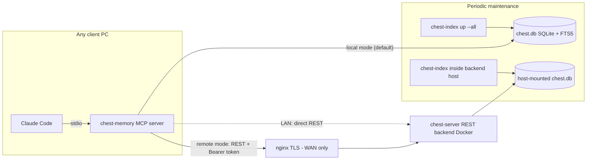

# mcp-chest-memory

**English** | [日本語](README.ja.md)

**Local-first persistent memory for coding agents, served over MCP.**
Your agent forgets everything when a session ends; chest gives it a durable,
searchable "past self" — failures it must not repeat, decisions and their
reasons, per-file edit history — stored in a single SQLite file on your machine.

Optimized for Claude Code (bundled skill + hooks), works with any MCP client.

## Features

- **6-layer structured memory** — `goal` / `context` / `emotion` /
  `implementation` / `realize` (failures & pitfalls, protected from
  forgetting) / `learning` (insights & decisions)
- **Hybrid recall** — SQLite FTS5 trigram full-text search fused with vector
  similarity via Reciprocal Rank Fusion, then weighted by recency heat,
  entity momentum, and importance
- **Multilingual by construction** — trigram tokenization needs no
  morphological analyzer; Japanese/Chinese/Korean and whitespace-delimited
  languages all work
- **Offline-first embeddings** — a small multilingual model
  (`multilingual-e5-small`, ONNX, ~120 MB) runs locally via transformers.js;
  no API key, no network after the one-time model download
- **Memory lifecycle** — ACT-R style activation decay, TTL expiry,
  archive-first deletion, supersession detection, sleep-mode consolidation
- **Token-saving file reads** — `chest_read_smart` caches file chunk hashes
  and returns only what changed since the last read
- **Session continuity** — work-state snapshots survive context compaction
  (Claude Code PreCompact/SessionStart hooks)
- **Three deployment profiles** — same tools, same semantics: single PC,
  LAN-shared (Docker), or WAN (nginx + TLS)

## Architecture



| Profile | Transport | Database lives | Setup |
|---|---|---|---|
| Single PC | stdio → in-process SQLite | `~/.chest-memory/chest.db` | `./tools/install.sh` |
| Multi-PC (LAN) | stdio → REST (Bearer) → Docker | host bind mount (`deploy/data/`) | `docker compose up` + `install.sh --remote` |
| Multi-PC (WAN) | stdio → nginx (TLS) → Docker | host bind mount | above + `deploy/nginx.conf.example` |

The MCP tool surface is identical in every profile: the stdio server either
executes tools in-process (local) or forwards the same JSON payload to the
backend (remote), which runs the very same executor code.

## Quick start (single PC)

Requirements: Node.js ≥ 22.

```bash
git clone https://github.com/siosig/mcp-chest-memory.git
cd mcp-chest-memory
./tools/install.sh
```

The installer is idempotent and will: build the project, create
`~/.chest-memory/`, initialize the SQLite database, prefetch the embedding
model (one-time download), register the MCP server with Claude Code, and
install the `/chest-memory` skill. Restart Claude Code and try:

> "Remember this: our staging DB resets every Monday."
> "Did we hit this error before?"

Uninstall (asks before touching your data):

```bash
./tools/uninstall.sh            # interactive
./tools/uninstall.sh --purge    # also delete ~/.chest-memory
```

### MCP tools

| Tool | Purpose |
|---|---|
| `chest_remember` | Save a memory into a layer (with importance, TTL, supersedes) |
| `chest_recall` | Hybrid search across memories (FTS5 + vector + decay-aware ranking) |
| `chest_recall_file` | Complete edit history of a file with per-edit intent |
| `chest_update_memory` | Edit a memory in place (preserves links) |
| `chest_list_entities` | Entity overview sorted by recent activity |
| `chest_forget` | Delete by id or run risk-based auto-forgetting (realize/goal/pinned protected) |
| `chest_consolidate` | Compress cold memories into learning summaries |
| `chest_read_smart` | Diff-cached file read (returns only changed chunks) |

## Multi-PC (LAN): Docker backend

On the host that owns the data:

```bash
cd deploy
CHEST_API_TOKEN=$(openssl rand -hex 32) docker compose up -d
```

The SQLite file is persisted on the host at `deploy/data/chest.db` and
survives container re-creation. Keep a single backend replica — one writer
process owns the database.

On each client PC:

```bash
./tools/install.sh --remote http://<host-ip>:8765 --token <same token>
```

Every client now shares the same memory: a `chest_remember` on PC-A is
recallable from PC-B. The backend enforces the Bearer token even on the LAN.

## Multi-PC (WAN): publishing through nginx

1. Run the Docker backend as above (bind it to localhost if nginx runs on the
   same host: change the port mapping to `127.0.0.1:8765:8765`).
2. Copy [`deploy/nginx.conf.example`](deploy/nginx.conf.example) into your
   nginx configuration, set `server_name` and certificate paths, then
   `nginx -t && systemctl reload nginx`.
3. Register clients against the public URL:

```bash
./tools/install.sh --remote https://chest.example.com --token <token>
```

Defense in depth: TLS terminates at nginx, while the backend still verifies
the Bearer token itself — a proxy misconfiguration never exposes an
unauthenticated backend. An optional HTTP Basic layer is sketched in the
example config.

## Embeddings

Embeddings are computed locally by `Xenova/multilingual-e5-small`
(quantized ONNX, 384 dimensions) via transformers.js — no API key, and fully
offline after the one-time model download (`tools/install.sh` prefetches it).

Saving never depends on embedding availability: if the model is unavailable,
the memory is stored with `embedding_status=pending` and backfilled later by
`chest-index`. Vectors are stamped with the model and dimension that produced
them; if a future release changes the bundled model, mismatched vectors are
excluded from vector recall (full-text recall is unaffected) until you
re-index:

```bash
chest-index status    # shows how many vectors don't match the current model
chest-index reembed   # resets them to pending and re-embeds
```

## How it works

### Storage

One SQLite database (WAL mode) holds entities, memories, edges, events, file
snapshots, sessions, and consolidation audit rows. Schema is managed by
Prisma migrations; the FTS5 virtual table and its sync triggers are plain SQL
inside the same migration.

### Full-text search: FTS5 trigram

`memories_fts` indexes 3-character substrings (`tokenize='trigram
remove_diacritics 1'`). This is language-agnostic: CJK text needs no word
segmentation and no MeCab-style analyzer. Queries shorter than 3 characters
fall back to a LIKE path. Scores come from SQLite's built-in `bm25()`.

### Hybrid ranking

For a recall query both paths run:

1. **FTS path** — trigram match, ranked by bm25
2. **Vector path** — query embedded by the local model, cosine similarity
   against stored vectors (only rows whose `(model, dim)` match the current
   model), top-k

The two rankings are fused with **Reciprocal Rank Fusion**
(`1/(k + rank_fts) + 1/(k + rank_vec)`), min-max normalized to a relevance
score. The final composite is:

```
composite = (0.45·relevance + 0.25·heat + 0.15·momentum + 0.15·importance)
            × activation × ttl_penalty × supersession_penalty
```

- **heat** — access frequency/recency of the memory (hot/warm/cold/frozen)
- **momentum** — recent activity of the owning entity
- **activation** — ACT-R inspired decay computed offline by `chest-index`
  from the access log
- **ttl / supersession penalties** — soft demotion before hard expiry

### Memory lifecycle

- **Archive-first**: nothing is physically deleted on decay; rows get
  `archived_at` and drop out of default recall
- **Supersession**: a newer, near-duplicate memory (cosine ≥ 0.97, same
  entity/layer, 90-day window) archives its predecessor and records the link
- **Consolidation**: cold low-importance memories are clustered per
  (entity, layer) and compressed into one protected `learning` summary
- **Protection**: `realize`-layer and pinned (importance ≥ 0.9) memories are
  never auto-forgotten
- **Snapshots**: a per-session work-state snapshot survives context
  compaction; the SessionStart hook restores it

### Maintenance

`chest-index up --all` (run it from cron or a systemd timer, e.g. every 10
minutes) executes: activation recompute → decay/archive sweep → supersession
sweep → embedding backfill of pending rows. All phases are guarded by a file
lock.

## Configuration reference

| Variable | Default | Meaning |
|---|---|---|
| `CHEST_MODE` | `local` | `local` = in-process SQLite; `remote` = forward to REST backend |
| `CHEST_DATA_DIR` | `~/.chest-memory` | Data root (database, model cache) |
| `CHEST_DB_PATH` | `<data dir>/chest.db` | SQLite file |
| `CHEST_REMOTE_URL` | — | Backend base URL (remote mode) |
| `CHEST_API_TOKEN` | — | Shared Bearer token (backend refuses to start without it) |
| `CHEST_PORT` | `8765` | REST backend listen port |
| `CHEST_MAX_CONTENT_CHARS` | `8000` | Max memory content length |
| `CHEST_SWEEP_LIMIT` | `500` | Max rows backfilled per `chest-index` embedding sweep |

## Claude Code integration

- **Skill**: `/chest-memory` (installed by `install.sh`) auto-classifies the
  recent conversation into `realize` vs `learning` and saves it with the
  rationale shown; `/chest-memory status` reports store health
- **Hooks** (optional): `chest-memory-precompact` saves a work-state snapshot
  before context compaction; `chest-memory-session-start` restores it;
  `chest-memory-sync` (Stop hook) auto-captures sessions —
  `chest-memory-setup --yes` wires these for you

## Development

```bash
pnpm install
pnpm typecheck
pnpm test          # node:test against a throwaway SQLite db
pnpm build
./tools/check-rebrand.sh   # release gate: naming/history/language checks
```

## License

[MIT](LICENSE)
