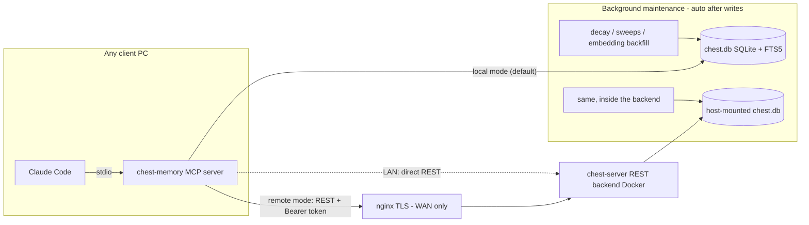

# mcp-chest-memory

**English** | [日本語](README.ja.md)

**These daily frustrations end today:**

- Giving the same instructions over and over
- Answering the same questions again and again
- Watching your LLM stumble in the same place every time
- Burning through tokens so fast you keep hitting your limits

mcp-chest-memory makes all of these a thing of the past — automatically.

- **Add this MCP server — then there is nothing left for you to do.**
- **It automatically remembers what was worked on, why things failed, and
  what research concluded — across all your projects.**

**With this MCP installed, your LLM grows together with you: mistakes and
repeated questions keep decreasing, and the LLM increasingly behaves like
an extension of yourself.**

**As a welcome side effect, it also cuts your LLM token usage substantially.**

**Local-first persistent memory for coding agents, served over MCP.**
Your agent forgets everything when a session ends; chest gives it a durable,
searchable "past self" — failures it must not repeat, decisions and their
reasons, per-file edit history — stored in a single SQLite file on your machine.

One memory store spans **all your projects and all your LLM agents**: knowledge
is recalled and recorded automatically by the LLM itself, without you having to
think about it — so you stop giving the same instructions over and over.

Optimized for Claude Code (bundled skill + hooks), works with any MCP client.

This MCP server is built to be easy to adopt. It scales from personal use to
multiple machines and on to a whole project team. Start with personal use and
feel the difference for yourself — getting started solo is very easy.

## Table of Contents

- [Features](#features)
- [Installation](#installation)
  - [Single PC (local SQLite)](#single-pc-local-sqlite)
  - [Import existing Claude Code history (optional)](#import-existing-claude-code-history-optional)
  - [Multi-PC (LAN): Docker backend](#multi-pc-lan-docker-backend)
  - [Multi-PC (WAN): Docker + nginx TLS](#multi-pc-wan-docker--nginx-tls)
  - [Uninstall](#uninstall)
- [Daily usage](#daily-usage)
  - [What you have to do: (almost) nothing](#what-you-have-to-do-almost-nothing)
  - [What runs automatically even if you do nothing](#what-runs-automatically-even-if-you-do-nothing)
  - [MCP tools](#mcp-tools)
- [How it works](#how-it-works)
  - [Architecture](#architecture)
  - [Memory layers](#memory-layers)
  - [Forgetting](#forgetting)
  - [Supersession (overwrite detection)](#supersession-overwrite-detection)
  - [Storage](#storage)
  - [Full-text search: FTS5 trigram](#full-text-search-fts5-trigram)
  - [Hybrid ranking](#hybrid-ranking)
  - [Memory lifecycle](#memory-lifecycle)
  - [Maintenance](#maintenance)
- [Configuration reference](#configuration-reference)
  - [Security notes](#security-notes)
- [Claude Code integration](#claude-code-integration)
- [Development](#development)
- [Security](#security)
  - [Threat model](#threat-model)
  - [Principles](#principles)
  - [What the code does](#what-the-code-does)
  - [Residual risks (by design)](#residual-risks-by-design)
- [License](#license)

## Features

- **6-layer structured memory** — `goal` / `context` / `emotion` /
  `implementation` / `realize` (failures & pitfalls, protected from
  forgetting) / `learning` (insights & decisions)
- **Hybrid recall** — SQLite FTS5 trigram full-text search fused with vector
  similarity via Reciprocal Rank Fusion, then weighted by recency heat,
  entity momentum, and importance
- **Multilingual by construction** — trigram tokenization needs no
  morphological analyzer; Japanese/Chinese/Korean and whitespace-delimited
  languages all work
- **Offline-first embeddings** — a small multilingual model
  (`multilingual-e5-small`, ONNX, ~120 MB) runs locally via transformers.js;
  no API key, no network after the one-time model download
- **Memory lifecycle** — ACT-R style activation decay, TTL expiry,
  archive-first deletion, supersession detection, sleep-mode consolidation
- **Token-saving file reads** — `chest_read_smart` caches file chunk hashes
  and returns only what changed since the last read
- **Session continuity** — work-state snapshots survive context compaction
  (Claude Code PreCompact/SessionStart hooks)
- **Three deployment profiles** — same tools, same semantics: single PC,
  LAN-shared (Docker), or WAN (nginx + TLS)

## Installation

Requirements: Node.js ≥ 24. No clone needed — everything runs via `npx`.

### Single PC (local SQLite)

The database lives at `~/.chest-memory/chest.db` on your machine.

#### One-command setup

```bash
npx -y -p mcp-chest-memory chest-memory-setup --yes
```

Registers the MCP server with Claude Code, installs the `/chest-memory` skill,
and wires the hooks. The database schema is created automatically on first
launch; the embedding model (~120 MB) downloads in the background on first
use.

#### Manual registration

```bash
claude mcp add -s user chest-memory -- npx -y mcp-chest-memory@latest
```

Then wire hooks and install the skill separately:

```bash
npx -y -p mcp-chest-memory chest-memory-install-hooks
npx -y -p mcp-chest-memory chest-memory-install-skill
```

### Import existing Claude Code history (optional)

Seed the memory store from every past session under `~/.claude/projects/`
and each project's curated auto-memory files (`memory/*.md`):

```bash
npx -y -p mcp-chest-memory chest-memory-import --all
```

Pass `--dry-run` to parse and report without writing. Pass `--skip-embed` to
skip embedding backfill (background maintenance will catch up later).
Re-running is safe — each session is wiped and re-inserted idempotently.

### Multi-PC (LAN): Docker backend

All clients share one SQLite database that lives on the Docker host.

#### Start the backend (on the host that owns the data)

Clone the repository to get the `deploy/` directory, then generate a token
and start the container:

```bash
git clone https://github.com/siosig/mcp-chest-memory.git
cd mcp-chest-memory
openssl rand -hex 32   # copy this — you need it on every client
cd deploy
CHEST_API_TOKEN=<token> docker compose up -d
```

The SQLite file is persisted at `deploy/data/chest.db` and survives container
re-creation. Keep a single backend replica — one writer process owns the
database.

#### Register each client PC

```bash
npx -y -p mcp-chest-memory chest-memory-setup --docker http://<host-ip>:8765 <token> --yes
```

#### Manual registration (each client)

```bash
claude mcp add -s user chest-memory \
  -e CHEST_MODE=remote \
  -e CHEST_REMOTE_URL=http://<host-ip>:8765 \
  -e CHEST_API_TOKEN=<token> \
  -- npx -y mcp-chest-memory@latest
```

### Multi-PC (WAN): Docker + nginx TLS

Same Docker backend as LAN, published through nginx with TLS.

#### Start the backend

Same as LAN. If nginx runs on the same host, bind the port to localhost:
change the port mapping in `compose.yaml` to `127.0.0.1:8765:8765`.

#### Configure nginx

Copy [`deploy/nginx.conf.example`](deploy/nginx.conf.example) into your nginx
configuration, set `server_name` and certificate paths, then
`nginx -t && systemctl reload nginx`. The example publishes the backend under
the `/chest-memory` path prefix; a health probe is available at
`https://chest.example.com/chest-memory/healthz`.

#### Register each client PC

```bash
npx -y -p mcp-chest-memory chest-memory-setup --nginx https://chest.example.com/chest-memory <token> --yes
```

#### Manual registration (each client)

```bash
claude mcp add -s user chest-memory \
  -e CHEST_MODE=remote \
  -e CHEST_REMOTE_URL=https://chest.example.com/chest-memory \
  -e CHEST_API_TOKEN=<token> \
  -- npx -y mcp-chest-memory@latest
```

Defense in depth: TLS terminates at nginx, while the backend still verifies
the Bearer token — a proxy misconfiguration never exposes an unauthenticated
backend.

### Uninstall

```bash
claude mcp remove -s user chest-memory
npx -y -p mcp-chest-memory chest-memory-install-hooks --remove
rm -rf ~/.claude/skills/chest-memory
rm -rf ~/.chest-memory   # only if you also want to delete your memories
```

## Daily usage

### What you have to do: (almost) nothing

After installation, just work with Claude Code as usual. The bundled
`/chest-memory` skill teaches the agent to recall and save memories on its
own. Everything below is optional:

- Say **"remember this: ..."** to force a save of something specific
- Invoke **`/chest-memory`** to save the recent context explicitly,
  or **`/chest-memory status`** to check store health
- Ask **"did we hit this before?"** to force a recall
- Hooks are wired automatically by `chest-memory-setup --yes`: session
  auto-capture on Stop, snapshot save/restore around compaction

### What runs automatically even if you do nothing

- **On every save** (`chest_remember`): the layer is classified by the
  agent, content is stored in SQLite, the FTS5 index updates via triggers,
  the vector is embedded in-process by the local model, and `realize`-layer
  memories are auto-protected from forgetting
- **On every recall** (`chest_recall`): FTS + vector hybrid search with
  decay-aware ranking; access heat is updated so frequently used memories
  rank higher over time
- **During a session** (skill-driven): recall at task start and before
  editing files with history; saves after errors are resolved or decisions
  are made
- **On every session end** (hooks, wired by `chest-memory-setup`): the session is
  captured on Stop, and work-state snapshots survive context compaction
- **In the background after saves** (throttled, at most once per
  `CHEST_MAINTENANCE_INTERVAL_SEC`, default 600 s / 10 min): activation decay
  recompute, TTL expiry and archive sweep, supersession detection,
  consolidation of cold memories, and embedding backfill for any pending
  rows. No scheduler setup is required; `chest-index up` remains available
  for manual runs

### MCP tools

| Tool | Purpose |
|---|---|
| `chest_remember` | Save a memory into a layer (with importance, TTL, supersedes) |
| `chest_recall` | Hybrid search across memories (FTS5 + vector + decay-aware ranking) |
| `chest_recall_file` | Complete edit history of a file with per-edit intent |
| `chest_update_memory` | Edit a memory in place (preserves links) |
| `chest_list_entities` | Entity overview sorted by recent activity |
| `chest_forget` | Delete by id or run risk-based auto-forgetting (realize/goal/pinned protected) |
| `chest_consolidate` | Compress cold memories into learning summaries |
| `chest_read_smart` | Diff-cached file read (returns only changed chunks) |

## How it works

### Architecture



| Profile | Transport | Database lives | Setup |
|---|---|---|---|
| Single PC | stdio → in-process SQLite | `~/.chest-memory/chest.db` | `chest-memory-setup --yes` |
| Multi-PC (LAN) | stdio → REST (Bearer) → Docker | host bind mount (`deploy/data/`) | `docker compose up` + `chest-memory-setup --docker` |
| Multi-PC (WAN) | stdio → nginx (TLS) → Docker | host bind mount | above + `deploy/nginx.conf.example` |

The MCP tool surface is identical in every profile: the stdio server either
executes tools in-process (local) or forwards the same JSON payload to the
backend (remote), which runs the very same executor code.


### Memory layers

Six layers define how memories are stored and decay:

| Layer | Meaning | Default TTL | Auto-protected |
|---|---|---|---|
| `goal` | Project objectives and targets | none | — |
| `context` | Background, timing, situational facts | 30 days | — |
| `emotion` | Tone, mood, and emotional state | 14 days | — |
| `implementation` | Code/config that worked or didn't; how things were tried | 90 days | — |
| `realize` | Failures, pitfalls, and traps that must not be repeated | none | **yes** |
| `learning` | Insights, decisions, and belief updates | 365 days | — |

`realize`-layer memories are created with `protected=1` and survive all
automatic forgetting sweeps. `goal` has no TTL and is exempt from forgetting.
`importance >= 0.9` pins any memory regardless of layer.

`context`, `emotion`, and `implementation` are subject to sleep-mode
consolidation: once cold (heat < 30) and older than 7 days, clusters of ≥ 2
per (entity, layer) are compressed into a single protected `learning` summary.

Accepted layer aliases: `decisions`/`insights`/`learned` → `learning`;
`warnings`/`pitfalls`/`rule` → `realize`; `why`/`goals` → `goal`; `how`/`tried` → `implementation`.

### Forgetting

Forgetting risk is computed per memory with an Ebbinghaus-inspired formula:

```
risk = heatFactor × importanceFactor × timeFactor

heatFactor       = 1 - (heatScore / 100)
importanceFactor = 1 - importance
timeFactor       = daysSinceLastAccess × (1 + daysSinceLastAccess / 30)
```

| risk | action |
|---|---|
| < 50 | keep |
| 50 – 199 | **compress** — archived and summarised into a `learning` entry |
| ≥ 200 | **drop** — fully deleted |

The heat score (0–100) is computed from access frequency and recency:
30-day access count (×3, cap 30) + 90-day count (cap 20) + recency bonus
(+20 if ≤ 7 days, −10 if > 90 days) + tenure bonus (cap 15) + importance
boost (up to 15). Bands: `hot` ≥ 70 / `warm` ≥ 40 / `cold` ≥ 20 / `frozen` < 20.

### Supersession (overwrite detection)

When a new memory is saved, the next maintenance pass compares it against
recent memories of the same entity and layer using cosine similarity. If a
near-duplicate is found (cosine ≥ 0.97), the older memory is archived and
linked to the new one — so the store never accumulates stale near-copies.

Guards that reduce false positives:
- Same entity + same layer required
- 90-day time window and 200-peer row cap per entity (prevents O(n²) scans)
- JSON memories with identical top-level key shapes are **not** superseded
  (periodic snapshots / file-edit logs that look structurally similar but hold
  distinct facts)

The `chest_remember` tool also accepts a `supersedes` list for manual
supersession without waiting for the batch sweep.

### Storage

One SQLite database (WAL mode) holds entities, memories, edges, events, file
snapshots, sessions, and consolidation audit rows. Schema is managed by
Prisma migrations; the FTS5 virtual table and its sync triggers are plain SQL
inside the same migration.

### Full-text search: FTS5 trigram

`memories_fts` indexes 3-character substrings (`tokenize='trigram
remove_diacritics 1'`). This is language-agnostic: CJK text needs no word
segmentation and no MeCab-style analyzer. Queries shorter than 3 characters
fall back to a LIKE path. Scores come from SQLite's built-in `bm25()`.

### Hybrid ranking

For a recall query both paths run:

1. **FTS path** — trigram match, ranked by bm25
2. **Vector path** — query embedded by the local model, cosine similarity
   against stored vectors (only rows whose `(model, dim)` match the current
   model), top-k

The two rankings are fused with **Reciprocal Rank Fusion**
(`1/(k + rank_fts) + 1/(k + rank_vec)`), min-max normalized to a relevance
score. The final composite is:

```
composite = (0.45·relevance + 0.25·heat + 0.15·momentum + 0.15·importance)
            × activation × ttl_penalty × supersession_penalty
```

- **heat** — access frequency/recency of the memory (hot/warm/cold/frozen)
- **momentum** — recent activity of the owning entity
- **activation** — ACT-R inspired decay computed offline by `chest-index`
  from the access log
- **ttl / supersession penalties** — soft demotion before hard expiry

### Memory lifecycle

- **Archive-first**: nothing is physically deleted on decay; rows get
  `archived_at` and drop out of default recall
- **Supersession**: a newer, near-duplicate memory (cosine ≥ 0.97, same
  entity/layer, 90-day window) archives its predecessor and records the link
- **Consolidation**: cold low-importance memories are clustered per
  (entity, layer) and compressed into one protected `learning` summary
- **Protection**: `realize`-layer and pinned (importance ≥ 0.9) memories are
  never auto-forgotten
- **Snapshots**: a per-session work-state snapshot survives context
  compaction; the SessionStart hook restores it

### Maintenance

Maintenance is self-driving: after a save, the server runs (in the
background, without delaying the response) activation recompute →
decay/archive sweep → supersession sweep → embedding backfill of pending
rows. Passes are throttled to once per `CHEST_MAINTENANCE_INTERVAL_SEC`
(default 600 s / 10 min) and guarded by a file lock, so they never overlap a manual
`chest-index up` run. Set `CHEST_AUTO_MAINTENANCE=0` to disable the
automatic passes and drive everything via `chest-index` yourself.

## Configuration reference

| Variable | Default | Meaning |
|---|---|---|
| `CHEST_MODE` | `local` | `local` = in-process SQLite; `remote` = forward to REST backend |
| `CHEST_DATA_DIR` | `~/.chest-memory` | Data root (database, model cache) |
| `CHEST_DB_PATH` | `<data dir>/chest.db` | SQLite file |
| `CHEST_REMOTE_URL` | — | Backend base URL (remote mode) |
| `CHEST_API_TOKEN` | — | Shared Bearer token (backend refuses to start without it; **minimum 32 characters**) |
| `CHEST_PORT` | `8765` | REST backend listen port |
| `CHEST_BIND_HOST` | `0.0.0.0` | REST backend listen host. Set to `127.0.0.1` to bind loopback only when a reverse proxy fronts the backend |
| `CHEST_MAX_CONTENT_CHARS` | `8000` | Max memory content length (clamped to ≥ 1; 0/negative are ignored) |
| `CHEST_FORGET_SWEEP_CAP` | `200` | Max memories archived per argument-less `chest_forget` sweep |
| `CHEST_SWEEP_LIMIT` | `500` | Max rows backfilled per embedding sweep |
| `CHEST_MAINTENANCE_INTERVAL_SEC` | `600` | Min seconds between background maintenance passes |
| `CHEST_AUTO_MAINTENANCE` | `1` | Set `0` to disable write-triggered maintenance |

### Security notes

- **Token length**: the REST backend requires `CHEST_API_TOKEN` to be at least 32
  characters and refuses to start otherwise. `openssl rand -hex 32` (64 chars) satisfies
  this.
- **Token on the command line**: passing the token inline to `claude mcp add` (or any
  shell command) leaves it visible in `/proc/<pid>/cmdline` and your shell history on a
  shared machine. Prefer setting it via your shell's secret manager or an env file, and
  clear the relevant history entry afterward.
- **Network exposure**: the LAN profile publishes the backend on all interfaces by
  default and protects it with the Bearer token only, in cleartext HTTP. Run it only on a
  trusted network, or restrict it with `CHEST_BIND_HOST=127.0.0.1` plus the nginx + TLS
  (WAN) profile. The bundled nginx example sends HSTS and a restrictive CSP.
- **File reads**: `chest_read_smart` only reads files inside the MCP client's declared
  roots and is unavailable on the REST backend (which has no client roots), so a token
  holder cannot read arbitrary files on the backend host.

## Claude Code integration

- **Skill**: `/chest-memory` (installed by `chest-memory-setup`) auto-classifies
  the recent conversation into `realize` vs `learning` and saves it with the
  rationale shown; `/chest-memory status` reports store health
- **Hooks** (wired by `chest-memory-setup --yes`): `chest-memory-precompact`
  saves a work-state snapshot before context compaction;
  `chest-memory-session-start` restores it; `chest-memory-sync` (Stop hook)
  auto-captures sessions. Re-wire any time with
  `npx -y -p mcp-chest-memory chest-memory-install-hooks`; remove with `--remove`

## Development

```bash
pnpm install
pnpm typecheck
pnpm test          # node:test against a throwaway SQLite db
pnpm build
```

### From source (for development or self-hosted LAN/WAN backend)

```bash
git clone https://github.com/siosig/mcp-chest-memory.git
cd mcp-chest-memory
pnpm install
pnpm build
npx -y -p mcp-chest-memory chest-memory-setup --yes   # local mode
# or for remote:
npx -y -p mcp-chest-memory chest-memory-setup --docker <url> <token> --yes
```

## Security

chest-memory stores a durable, cross-project record of how you and your agents
work. That store is valuable, so it is also worth protecting. This section
describes the threat model the project designs against and the concrete measures
in the code.

### Threat model

Two principals can reach the tools, and neither is fully trusted:

1. **The LLM agent itself.** An agent reads third-party content (repositories,
   web pages, issues) and can be steered by **prompt injection** hidden in that
   content. So a tool call is not automatically a trustworthy request — it may be
   an attacker's request laundered through the model.
2. **Any holder of the shared Bearer token** (LAN/WAN profiles). The REST backend
   authenticates with one shared token; anyone who has it can POST arbitrary tool
   payloads to the backend host.

The design goal is that neither a prompt-injected agent nor a token holder can
read arbitrary host files, dump the whole memory store, or silently destroy or
rewrite memories.

### Principles

- **Fail closed.** When the safe scope is unknown, deny. File reads with no
  declared roots return nothing rather than falling back to "read anything".
- **No deployment branches in tool logic.** Profile differences flow only through
  the executor port (`src/core/executor.ts`); a tool behaves identically in every
  profile. Where a tool must refuse on the backend, that falls out of the *input*
  (no client roots) rather than an `if (remote)` branch.
- **Protect the irreplaceable.** `realize` (pain lessons), pinned
  (`importance >= 0.9`), and `goal` memories are exempt from every automated and
  caller-driven removal path.
- **Root-cause over symptomatic fixes.** Cross-cutting concerns live in one
  audited helper (LIKE-escaping, path confinement, atomic writes) instead of being
  re-implemented per call site.
- **Defense in depth.** TLS terminates at nginx *and* the backend still verifies
  the token; content caps are enforced in both the schema and the handler.

### What the code does

| Risk | Measure | Where |
|---|---|---|
| Arbitrary host file read via `chest_read_smart` | Reads are confined to the MCP client's declared roots, symlinks are resolved (`realpath`) before the check, and the same canonical path is used for `stat` and `read` (no check/use gap). Empty roots deny everything, so the REST backend (no client roots) refuses the tool. | `src/mcp/roots.ts` (`confinePath`), `src/mcp/read-smart.ts` |
| Full-store disclosure via wildcard input | All user values interpolated into SQL `LIKE` are escaped (`%`, `_`, `\`) with an explicit `ESCAPE` clause, so `query: "%"` matches literally instead of every row. | `src/lib/db/sql-escape.ts`, `chest_recall`, `chest_recall_file` |
| Silent destruction of protected memory via `supersedes` | `supersedes` skips protected/pinned/goal targets and reports them; the low-level supersede guards the manual path too. | `chest_remember`, `src/lib/supersession.ts` |
| Mass-archival via an argument-less `chest_forget` | The sweep archives at most `CHEST_FORGET_SWEEP_CAP` (default 200) per call and reports `affected`/`remaining`; protected layers stay exempt. | `chest_forget` |
| Content-cap bypass via `chest_update_memory` | The same `MAX_CONTENT_CHARS` limit is enforced in the schema and the handler. | `chest_update_memory` |
| SQL injection | Every query binds values as parameters — no user string is concatenated into SQL. Simple CRUD uses the Prisma ORM (typed columns, no string-built clauses); the remaining raw SQL is reserved for SQLite-specific features (FTS5/`bm25`, vector ranking, claim-style updates) and still parameter-bound. The previous dynamic `SET`-clause builder was replaced by a typed ORM update. | repo-wide |
| Stored-memory prompt injection | Recall responses carry a notice that memory `content` is untrusted **data, not instructions**; the consolidation prompt wraps each memory in `<memory_data>` tags with a treat-as-data preamble. | `chest_recall`, `src/mcp/sampling.ts` |
| Settings corruption / secret leakage | `~/.claude/settings.json` is written atomically (temp file + rename) and owner-only (`0600`); hook logs are `0600`; the Stop-hook importer only accepts transcripts under `~/.claude/projects`. | `src/lib/fs-atomic.ts`, `src/lib/hooks-install.ts`, `src/bin/sync-session.ts` |
| Container/host compromise | The Docker image runs as the non-root `node` user over the bind mount; the maintenance lock lives in the user-owned data dir (not world-writable `/tmp`). | `deploy/Dockerfile`, `src/cli/chest-index-flock.ts` |
| Weak auth / network exposure | The backend requires a Bearer token of at least 32 characters, compares it in constant time, binds the host configured by `CHEST_BIND_HOST`, and limits request bodies to 1 MB (50 MB for the session-ingestion endpoint). The nginx example sends HSTS and a restrictive CSP. | `src/http/`, `deploy/nginx.conf.example` |

### Residual risks (by design)

- The **LAN profile uses cleartext HTTP**: the token and memory content cross the
  network in the clear. Run it only on a trusted network, or use the WAN profile
  (nginx + TLS). See [Security notes](#security-notes).
- The shared token grants **full access**: there is no per-client scoping. Treat it
  as a high-value secret.
- Data markers **reduce but do not eliminate** stored prompt-injection risk; they
  are one layer, not a guarantee.

Found a vulnerability? Please open a private report rather than a public issue.

## License

[MIT](LICENSE)
